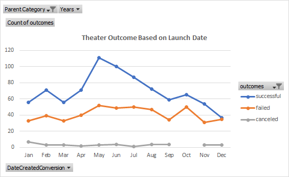
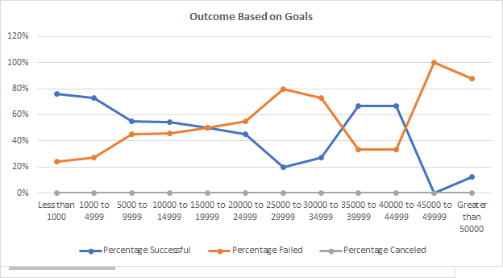

# Assignment

# Kickstarting with Excel

## Overview
Louise is looking to raise funds for her play through crowd funding campaign. Her estimated budget for the play is around $10,000. To plan and position her campaign launch successful she wants to analyse historical data of campaigns launched in past few years. We shall be analysing timing of launches and campaign goal for the historical campaigns and its impact on campaign success. Since target program is a play, we shall be concentrating our analysis to the campaigns launched for theatres and plays. 

### Purpose
The purpose of this project is to understand impact of launch dates and funding goals on campaign performance.  The aim of this study is to recognize and establish relationship between campaign launch timing and campaign goal with the campaign performance. 

## Analysis and Challenges

### Analysis of Outcomes Based on Launch Date

 
Graph 3.1 Outcome based on Launch Date for Theatre Category 

From the above graph we can understand that most successful projects were launched between April to August months of the year. While, the failed campaign launches peeks in May and October months. If we closely monitor the trend of data from May to July, we can see that the number of projects launched during this phase are comparatively higher than rest of year. Considering the number of total launches, the performance of the campaigns during May to July are fairly higher than rest of the months. Also, if we just consider US market, then the success ratios are higher for May and June month as compared to other months. 

If we check another important fact that during October month, launches of the campaigns are considerably high. However, number of failed campaigns are also higher during this time. Hence the success ratio for campaigns launched during October month have been consistently poor for last couple of years. Whereas, for campaigns launched during May and June months have higher success ratio comparatively to the campaigns launched during other months of the year. Even if we consider that the campaign is going to be launched in US, story persists and the trend remains the same. 

### Analysis of Outcomes Based on Goals

 
Graph 3.2 Outcome based on Goals for Plays Subcategory

If we try to check the outcome based on the monetary goals of the campaign, it clearly indicates that as the goal increases, chance of success of campaign are less. When the campaign goal is more than $10,000, chances of success narrows down and as we move beyond $20,000, chances of failure for the campaign becomes higher than chance of its success. The success ratio is highest when the goal for the campaign is around in the range of $1,000 to $4,999. 

### Challenges and Difficulties Encountered

This analysis has certain limitation, as the available data-set is up to early 2017 and hence in the absence of most recent information, the result may deviate from the conclusion of the analysis. The findings are based on historical data analysis for available time frame. The analysis is based on at least 5 years of comprehensive data, and hence the analysis is robust enough to withstand in most of the scenarios excluding any most recent market change. 

One of the challenges experienced during the analysis was that, the number of the campaign launched during a particular time frame was not giving any clear picture as numbers were very absolute and both successful and failed campaign were showing similar trend over the period of time. Hence to overcome this shortcoming I tried to find ratio of success vs failed campaign for a particular month and that gave a better approach to understand the trend and come to a more concrete result. 

## Results

- What are two conclusions you can draw about the Outcomes based on Launch Date?

    •	The chances of a campaign to be successful are more when the campaign is launched during the month of May and June of the year. 
    
    •	The chances of a campaign to fail are highest when the campaign is launched during the month of October. 

- What can you conclude about the Outcomes based on Goals?

    •	The analysis concludes that when the goal is less than $5,000, chances of campaign to be successful are higher. 

- What are some limitations of this dataset?

    •	Limitation of the dataset is non-availability of the most recent data. Available data for analysis is till 2017 February.

- What are some other possible tables and/or graphs that we could create?

    •	One of the graphs possible to plot is to check outcome based on the length of the campaigns to understand the length of exposure needed for reaching to goal
    
    •	Also, we can tabulate or plot “Average Donations” versus the “goal” for successful campaigns to understand the reach of the campaign to achieve the goal for the target campaign.
